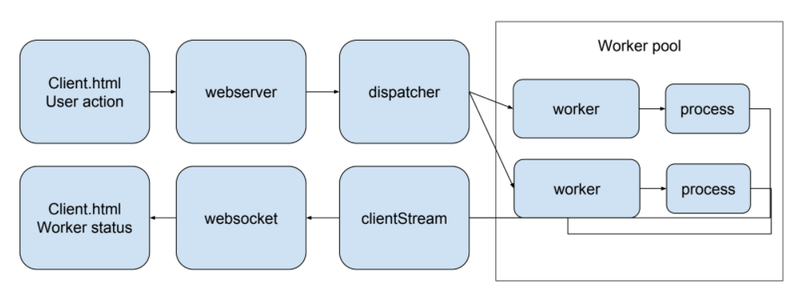
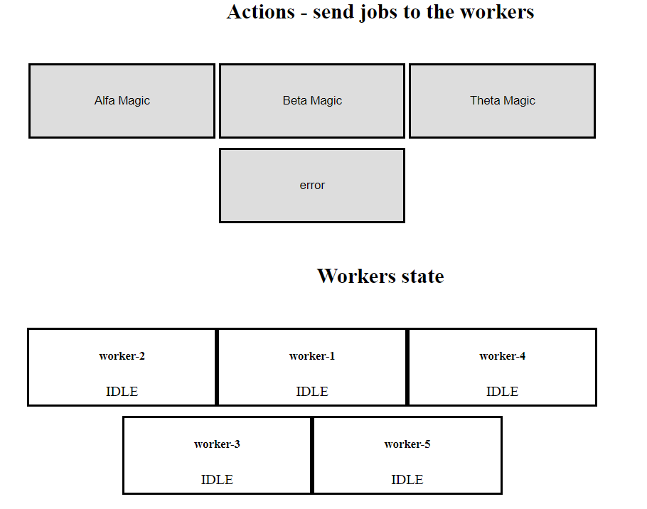

# Go workers thread pool

Visual implementation of a Concurrent Pattern more exactly a [Thread Pool](https://en.wikipedia.org/wiki/Thread_pool). It is based on [Marcio Castilho
 blog article "Handling 1M requests per minute"](https://medium.com/smsjunk/handling-1-million-requests-per-minute-with-golang-f70ac505fcaa). The differences from the article code & this repo:
 
 * extracted the process function (for testing and clarity)
 * removed the JOB_QUEUE global variable
 * added unit test & web server for a better understanding on how it works
 * split the algorithm to different files
 * added a dummy Client & waiting times

### Thread pool (workers)

> In computer programming, a thread pool is a software design pattern for achieving concurrency of execution in a computer program. Often also called a replicated workers or worker-crew model, a thread pool maintains multiple threads waiting for tasks to be allocated for concurrent execution by the supervising program. By maintaining a pool of threads, the model increases performance and avoids latency in execution due to frequent creation and destruction of threads for short-lived tasks.

### Why?

I want to get a better grasp of the pattern so I made a dummy  running example, with a few alternations. I also added a visual representation using a HTML basic client & websockets. The user can send fake jobs to process, and everything is slowed down (to seconds) so the user can observe the worker behaviours.



### Demo 



### Usage

```bash
go get github.com:bgadrian/go-worker-thread-pool

#make sure you have port 8080 free
#for windows 
cd %GOPATH%/src/github.com/bgadrian/go-worker-thread-pool/
go build -o server.exe & server.exe -MAX_WORKERS=5
#for Linux/MacOS
go build -o webserver && chmod +x ./webserver && ./webserver -MAX_WORKERS=5

#open http://localhost:8080 in your browser & keep this process open.
```


#### Copyright
B.G.Adrian 2017

